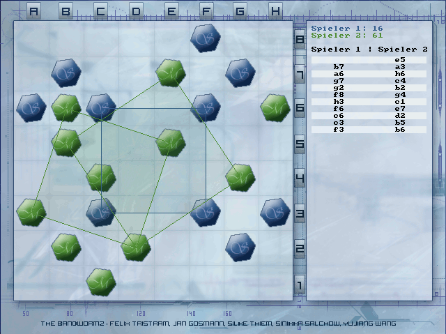

# Squared 2.2

Copyright (C) 2005, 2008 Jan Gosmann
http://www.hyper-world.de

Bei Squared handelt es sich um einen Metasquares-Klon, bei dem entweder gegen
einen anderen menschlichen Spieler an einem PC oder eine künstliche
Intelligenz angetreten werden kann.

# Die Regeln

Beide Spieler setzen abwechselnd einen Spielstein auf das Spielfeld.
Vier Steine eines Spielers im Quadrat bringen Punkte. Dabei dürfen die Seiten
des Quadrats auch schräg zum Spielfeldrand verlaufen. Je größer das Quadrat,
desto mehr Punkte gibt es.
Die genaue Punktzahl für ein Quadrat X ergibt sich folgendermaßen: Es wird das
kleinste Quadrat, dessen Seiten parallel zum Spielfeldrand sind und das X
komplett umschließt, genommen. Die Seitenlänge dieses umschließenden Quadrats
entspricht der Punktzahl.
Es gewinnt der Spieler, der entweder zuerst 150 Punkte erreicht oder einen
Vorsprung von 10% gegenüber dem Gegenspieler hat.

# Über die Entstehung dieses Spieles:

Ich habe dieses Spiel für einen Schülerwettbewerb im Jahre 2005 entwickelt.
Schließlich habe ich es 2008 wieder hervorgekramt von einer Backup-CD, ein
paar kleine Änderungen vorgenommen und veröffentlicht.
